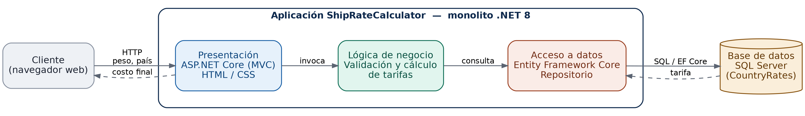
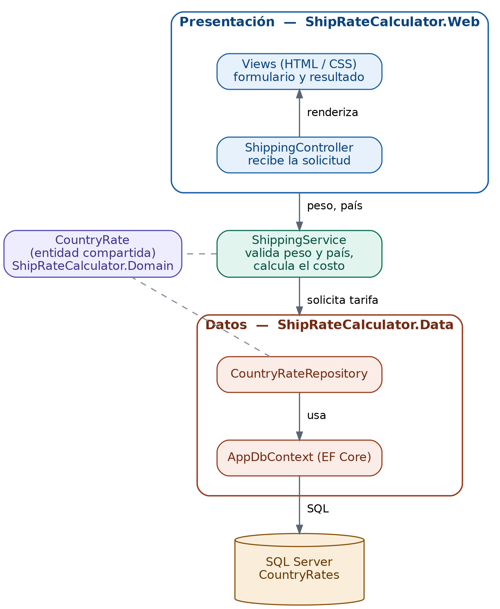
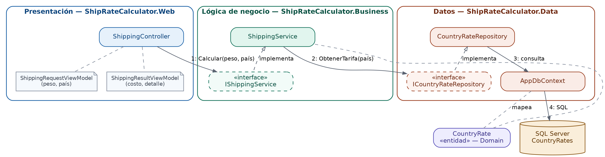

# ShipRateCalculator

Módulo web que permite a un cliente ingresar el peso de su paquete y el país
de destino, y obtener automáticamente el costo del envío según las reglas de
negocio vigentes para cada región, almacenadas en base de datos.

> Estado del proyecto: en construcción. Este README documenta el diseño y la
> estructura del repositorio; la implementación se desarrolla paso a paso.

## Reglas de negocio

| País | Tarifa por kg |
|---|---|
| India (IN) | USD 5 |
| Estados Unidos (US) | USD 8 |
| Reino Unido (UK) | USD 10 |

`costo = peso del paquete (kg) × tarifa del país`

Las tarifas viven en la base de datos (tabla `CountryRates`), no hardcodeadas
en el código, para poder agregar o modificar países sin recompilar la
aplicación.

## Stack tecnológico

| Capa | Tecnología |
|---|---|
| Presentación | ASP.NET Core Web App (MVC), HTML, CSS |
| Lógica de negocio | C# — .NET 8 (Class Library) |
| Acceso a datos | Entity Framework Core 8 |
| Base de datos | SQL Server |
| IDE | Visual Studio 2022+ |

## Arquitectura

**Monolito con división por capas.** Es una sola aplicación desplegable,
pero internamente separada en 4 proyectos de la solución, cada uno con una
responsabilidad y con dependencias en una sola dirección:

```
ShipRateCalculator.Web  --->  ShipRateCalculator.Business  --->  ShipRateCalculator.Data
                                        |                               |
                                        v                               v
                              ShipRateCalculator.Domain  <---------------
```

- **Web** (presentación) solo conoce a **Business**.
- **Business** (lógica de negocio) conoce a **Data** y **Domain**.
- **Data** (acceso a datos / EF Core) conoce a **Domain**.
- **Domain** (entidades) no conoce a nadie — es el núcleo compartido.







## Estructura del repositorio

```
ShipRateCalculator/
├── README.md
├── .gitignore
├── ShipRateCalculator.sln
├── src/
│   ├── ShipRateCalculator.Web/          # Presentación: controladores, vistas, wwwroot/css
│   ├── ShipRateCalculator.Business/     # Lógica de negocio: validación y cálculo de tarifas
│   ├── ShipRateCalculator.Data/         # Datos: DbContext, scripts SQL, repositorios (sin migrations)
│   └── ShipRateCalculator.Domain/       # Entidades compartidas (CountryRate, etc.)
└── docs/
    ├── diagramas/                       # Diagrama de solución, de capas y de componentes
    └── capturas/                        # Captura de la app funcional
```

## Modelo de datos (borrador)

Tabla `CountryRates`, gestionada por EF Core:

| Columna | Tipo | Descripción |
|---|---|---|
| `Id` | int, PK | Identificador |
| `Code` | nvarchar(5) | Código de país (`IN`, `US`, `UK`) |
| `Name` | nvarchar(100) | Nombre del país |
| `RatePerKg` | decimal(10,2) | Tarifa en USD por kg |

Agregar un país nuevo, una vez implementado, será un `INSERT` en esta tabla
(o un formulario de administración) — sin tocar código de negocio ni de
presentación.

> **Nota:** el esquema de esta tabla se crea y versiona con scripts SQL
> planos (`src/ShipRateCalculator.Data/Scripts/`), no con EF Core
> Migrations. Ver el README de `ShipRateCalculator.Data` para el detalle.

## Cómo clonar y continuar el desarrollo

1. Clonar el repositorio:
   ```bash
   git clone <url-del-repo>
   ```
2. Abrir `ShipRateCalculator.sln` en Visual Studio 2022 (o crearla ahí si
   aún no existe: **Archivo → Nuevo → Proyecto en blanco (Blank Solution)**
   con este mismo nombre, en la carpeta raíz del repo).
3. Agregar los 4 proyectos dentro de `src/` según lo descrito en el README
   de cada carpeta (`Web`, `Business`, `Data`, `Domain`), todos apuntando a
   **.NET 8**.
4. Configurar la cadena de conexión a SQL Server en
   `appsettings.json` / `appsettings.Development.json` del proyecto `Web`.
5. Crear la base de datos ejecutando el script
   `src/ShipRateCalculator.Data/Scripts/001_create_database.sql` en SQL
   Server (SSMS, Azure Data Studio o `sqlcmd`). **No se usan EF Core
   Migrations** — ver el README de `ShipRateCalculator.Data` para el
   detalle de este enfoque *Database First*.
6. Ejecutar el proyecto `Web` (F5 en Visual Studio).

## Seguridad y datos de clientes

- La cadena de conexión y cualquier secreto se mantienen fuera del control
  de versiones (ver `.gitignore`: `appsettings.Development.json`,
  `appsettings.Local.json`).
- La entrada del usuario (peso, país) se valida tanto en el cliente como en
  la capa de negocio antes de tocar la base de datos.
- No se captura ni almacena información personal identificable del cliente
  en esta versión (nombre, dirección, pagos).
- Las consultas a la base de datos se hacen vía EF Core (parametrizadas por
  diseño), evitando inyección SQL.

## Documentación (`docs/`)

La documentación visual del proyecto vive versionada junto al código, no en
un archivo aparte:

```
docs/
├── diagramas/
│   ├── diagrama-solucion.png       # visión general del sistema
│   ├── diagrama-capas.png          # presentación / negocio / datos
│   └── diagrama-componentes.png    # clases, interfaces e interacciones
└── capturas/
    └── app-funcional.png           # captura de la app calculando una tarifa
```

Cada diagrama tiene su versión `.png` (para verse embebido en este README y
en GitHub) y `.svg` cuando aplique (para impresión o edición). Están
referenciados abajo, en la sección de arquitectura, y se explican con más
detalle en el documento de diseño del proyecto.

## Roadmap

- [x] Repositorio y README inicial
- [x] Diagrama de diseño de la solución
- [x] Diagrama en capas
- [x] Diagrama de componentes
- [x] Script SQL del modelo de datos (sin migrations)
- [ ] Implementación de las 4 capas
- [ ] Captura de la aplicación funcional
